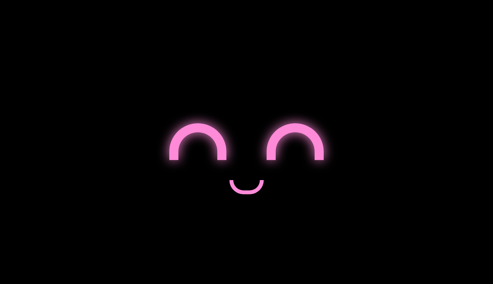
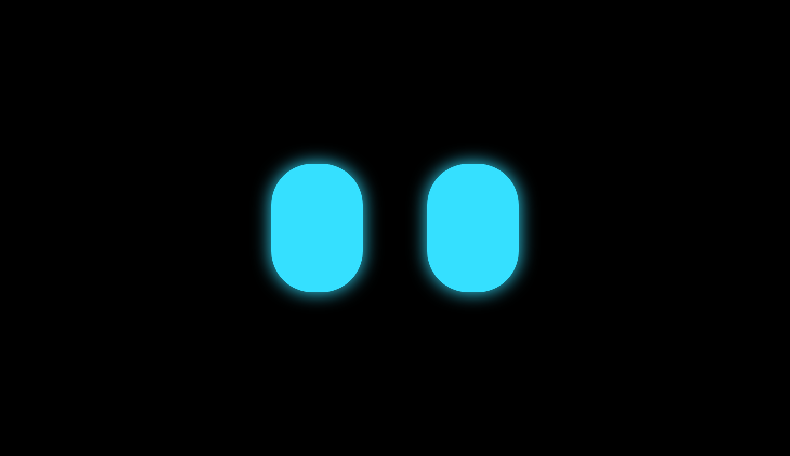
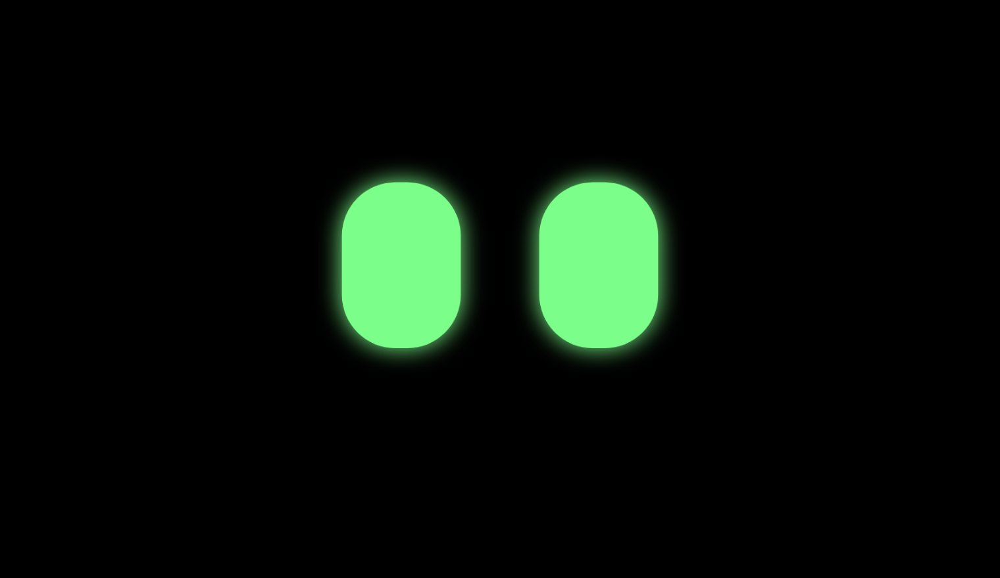
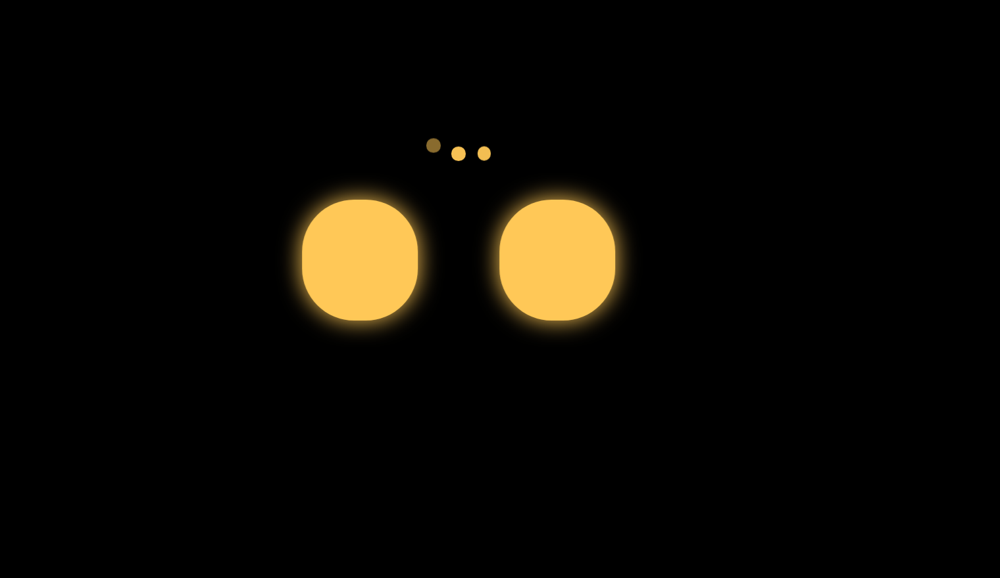
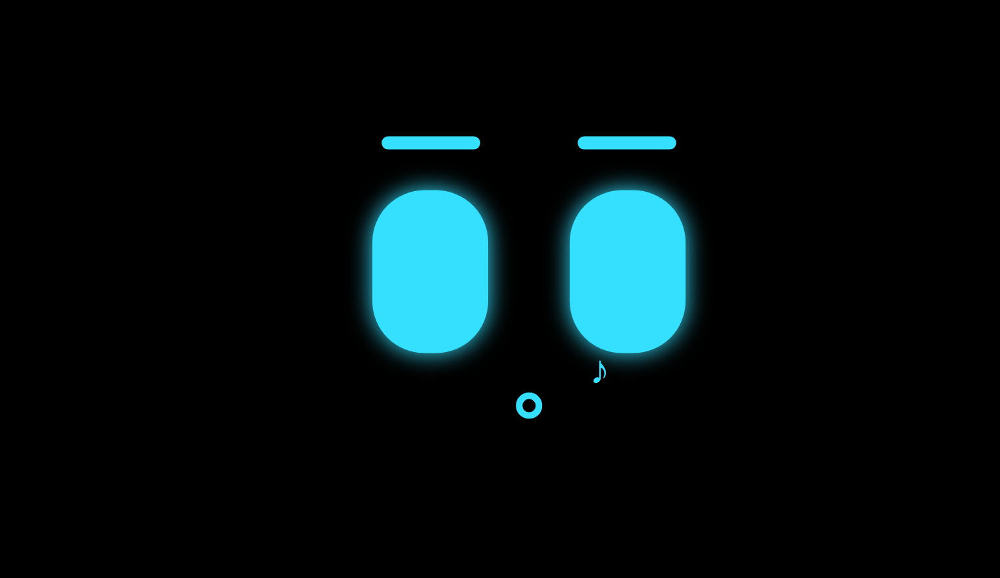
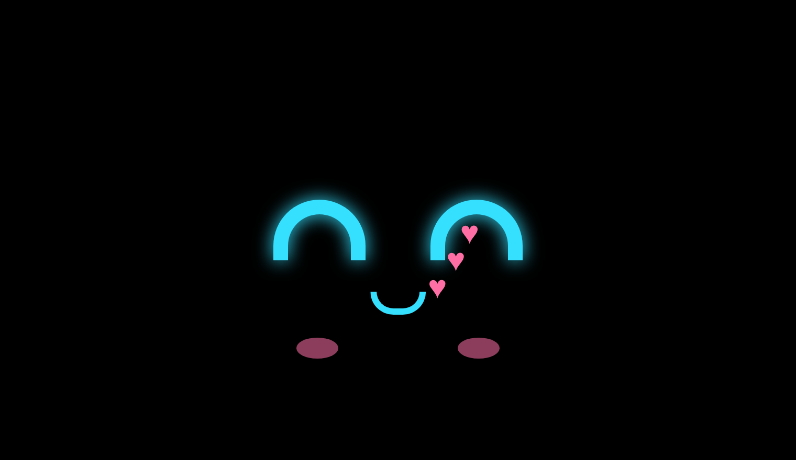
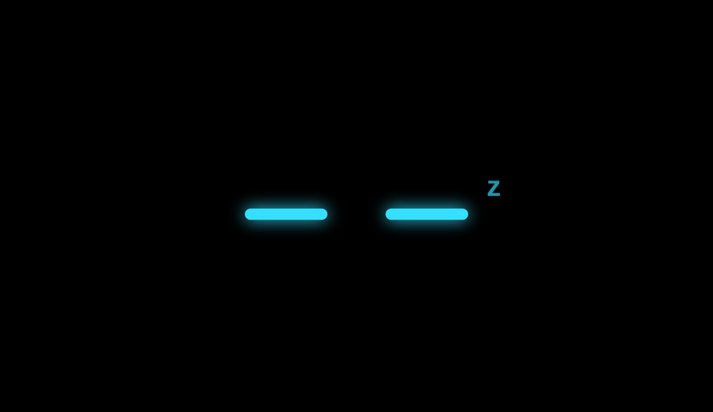

<div align="center">

# Eilik Face for Kiosk Satellite

**A robot face that lives on your kiosk screensaver and reacts to the voice assistant.**

It listens, thinks and talks back — without ever tearing down your screensaver.



[](LICENSE)


</div>

---

## Voice states

The face follows your `assist_satellite` entity through a full voice turn. Each state has its own
eye shape, motion and color, so you can read it from across the room.

| | State | What you see |
|---|---|---|
|  | **Idle** | Rounded eyes in cyan. Blinks, glances around and gets up to its own business |
|  | **Listening** | Green, pulsing eyes looking up at you |
|  | **Thinking** | Amber, narrowed eyes scanning side to side under three bouncing dots |
|  | **Speaking** | Pink eyes bouncing to the speech, smiling, with an optional mouth |

## It has a personality

Left alone, the face does not just blink. It picks a random little activity every few seconds —
whistling, humming, dancing, yawning, getting bored, getting curious, blushing — and then settles
back down. After a configurable idle period it yawns and falls asleep.

| | | |
|---|---|---|
|  |  |  |
| Whistling | In love | Asleep |

## Requirements

- Kiosk Satellite **2026.9.87 or newer**. From that version a voice turn no longer dismisses the
  screensaver, which is what makes the reactive face possible in the first place.
- Plugin SDK 1, Android SDK 24 or newer.
- Optional but recommended: a Home Assistant `assist_satellite.*` entity. Without one the face can
  only tell *listening* from *idle*.

## Install

1. Build the plugin (see [Build](#build)), or grab the ZIP and use
   **Plugin Manager → Developer Tools → Install from ZIP**.
2. Enable **Cara Eilik** in Plugin Manager.
3. Go to **Screensaver → Screensaver mode** and pick **Cara Eilik (Cara Eilik)**. It can also be
   selected in a screensaver schedule entry.
4. Open the plugin settings, group **Voz**, and choose your `assist_satellite.*` entity.

Run the **Demo de estados** action with the screensaver on screen to walk through listening,
thinking and speaking without saying a word.

## Settings

| Setting | Key | Default | What it does |
|---|---|---|---|
| Eye color (at rest) | `eyeColor` | `#35E0FF` | Idle eye color |
| Background color | `bgColor` | `#000000` | Screensaver background |
| Face size | `eyeSize` | `100` | 50–150 % of the base size |
| Show mouth when speaking | `showMouth` | `false` | Adds a mouth that moves with the reply |
| Sleep after | `sleepMinutes` | `10` | Minutes of idle before falling asleep. `0` never sleeps |
| `assist_satellite` entity | `assistEntity` | — | Unlocks the full listening / thinking / speaking cycle |
| Listening color | `listenColor` | `#7CFF8A` | |
| Thinking color | `thinkColor` | `#FFC857` | |
| Speaking color | `speakColor` | `#FF8AD8` | |
| Screen diagnostics | `diagnostics` | `false` | Reports what is actually on screen. See [Troubleshooting](#troubleshooting) |

All settings save automatically and refresh the running screensaver.

## How it tracks the conversation

The plugin takes the most precise signal available and falls back gracefully.

**With an `assist_satellite` entity** (`host.read`), the entity state maps straight to a face:

| Entity state | Face |
|---|---|
| `listening` | Listening |
| `processing` | Thinking |
| `responding` | Speaking |
| anything else | Idle |

A wake word still nudges the face into *listening* for a couple of seconds, so it reacts the
instant you speak rather than waiting for the entity to catch up.

**Without an entity**, the plugin falls back to the `wakeword.detected` and `voice.interaction`
events. These only distinguish *listening* (held for 30 seconds, or until the interaction ends)
from *idle*.

Face changes are coalesced and published at most once every 300 ms, within the SDK's limit of four
screensaver publications per second. If KS rejects a publication anyway, the plugin backs off
exponentially (up to about 4.8 s) and keeps retrying on its own, so the face comes back even when no
further voice events arrive.

## Troubleshooting

### The screen goes black while I am talking

KS shows a **black background when a plugin's renderer is unavailable**, so a black screen means the
face is not published — not that something is covering it. Turn on **Screen diagnostics** in the
plugin settings and watch the plugin status line during a voice turn. It appends what KS reports:

```text
Cara: speaking (entidad) · protector: activo, vista: dim, pantalla: encendida
```

- **`No se pudo publicar la cara: ...`** in the status or log means KS is rejecting the publication,
  usually the four-per-second limit. The plugin now backs off and recovers by itself.
- **`protector: activo`** with the face still black points at KS rather than the plugin: full-screen
  Now Playing removes the rendered document, and dim mode has no overlay at all.
- **`pantalla: apagada`** means the display itself went off, which is screen-off policy, not the face.

Turn the setting back off afterwards. The diagnostic events never republish the face, so leaving it
on does not add screensaver churn — it only adds log noise.

## Notes and limits

- Every state change recreates the screensaver document — the SDK requires it — so the face
  restarts its animation with a soft fade-in.
- Kiosk Satellite owns the screensaver: activation, idle timeout, schedules, brightness, touch
  dismissal and pixel shift are all still its job. The plugin only draws inside it.
- Input belongs to KS. Nothing inside the face is tappable.
- Full-screen Now Playing removes the rendered document.
- The face honors `prefers-reduced-motion` and drops its animations when the system asks for it.

## Build

```sh
python3 tools/test.py     # unit tests and manifest checks
python3 tools/build.py    # packaged plugin ZIP
```

The Android SDK and Java must be configured as described in the
[plugin build guide](docs/creating-plugins.md). Developer ZIP installation is for local testing;
publish through GitHub Releases using the supplied workflow, as described in the
[installation guide](docs/installing-plugins.md).

### Regenerating the screenshots

The images in this README are rendered from the real screensaver assets, not mocked up:

```sh
npm i -D playwright && npx playwright install chromium
node tools/screenshots.js
```

## Documentation

- [Creating plugins](docs/creating-plugins.md)
- [Plugin screensavers](docs/screensavers.md)
- [KS interaction API](docs/ks-api.md)
- [Home Assistant entities](docs/home-assistant.md)

## License

[Apache-2.0](LICENSE)
